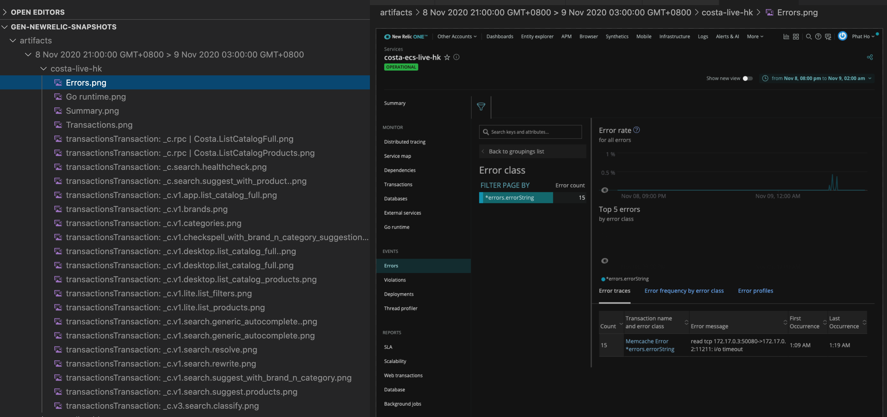
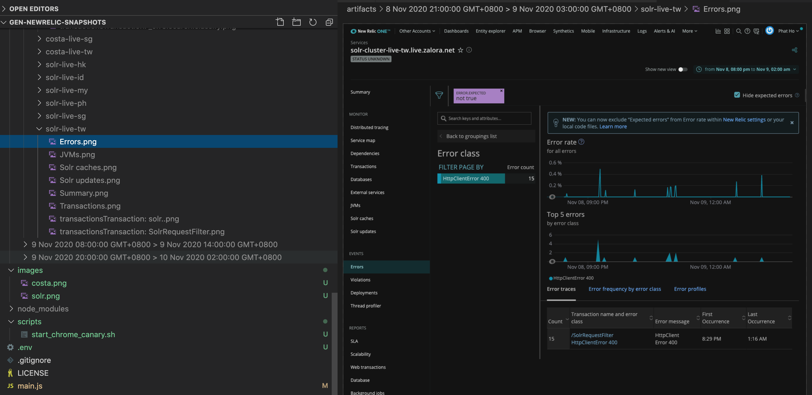

# gen-newrelic-snapshots

Take NewRelic screenshots as snapshots

### Costa


### Solr


## Usage

- Download Google Chrome Canary (if you are on Macos, the link to Google Chrome Canary should be same with the next step)

- Start your Chrome Canary in debugging mode
```
./scripts/start_chrome_canary.sh
```

- **!!! Important, remember to visit your newrelic page, before next step !!!**. Make sure you already logged in into NR. On opening new relic page, a lot of things need to be loaded, so opening newrelic page before avoids reloading the whole site on first visit.

- Configure your account ids, application ids and time ranges in `config.json`  , then run:
```
yarn start
```

## Note
Please use Newrelic new View as selectors are designed based on new view

## Improvements
- Publish to npm
