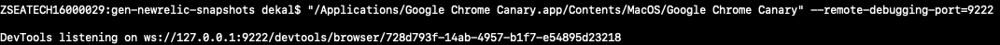

# gen-newrelic-snapshots

Take NewRelic screenshots as snapshots

## Usage

- Download Google Chrome Canary (if you are on Macos, the link to Google Chrome Canary should be same with the next step)

- Start your Chrome in debugging mode
`"/Applications/Google Chrome Canary.app/Contents/MacOS/Google Chrome Canary" --remote-debugging-port=9222`

- Get ws endpoint `ws://127.0.0.1:9222/devtools/browser/xxx`

- Make sure you already logged in into NR.

- Configure your account ids, application ids, time ranges in main.js, then run:
`WS_ENDPOINT=ws://127.0.0.1:9222/devtools/browser/xxx node main.js`

## Improvements
- Publish to npm
